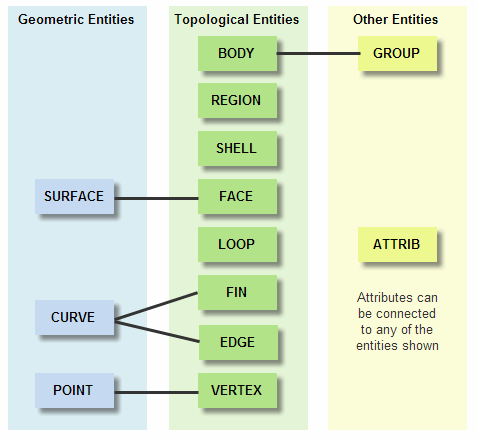
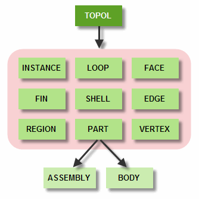
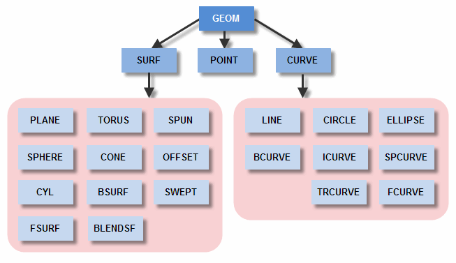

# Basic math

Position Vector Matrix

# PK_ENTITY

# PK_TOPOL

PK_PART PK_BODY PK_REGION PK_SHELL PK_FACE PK_EDGE PK_LOOP PK_VERTEX

# Geom

PK_GEOM

PK_SURF PK_BSURF PK_BLENDSF PK_CONE PK_CYL PK_OFFSET PK_PLANE PK_SPHERE PK_SPUN PK_SWEPT PK_TORUS

PK_CURVE PK_BCURVE PK_CIRCLE PK_ELLIPSE PK_FCURVE PK_LINE PK_POINT PK_SPCURVE PK_TRCURVE
